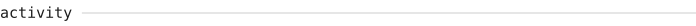
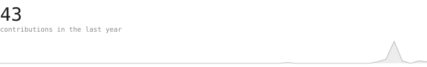
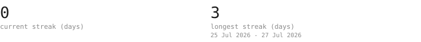
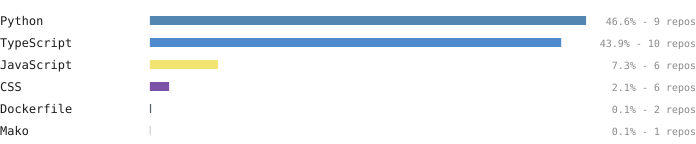

<blockquote>
A self-generating GitHub profile: every graphic on this page is drawn by 
this repository on a nightly schedule, with zero third-party requests.
</blockquote>

 

 

 

 

 

Portrait pipeline adapted from the <a href="https://burly-handstand-0dc.notion.site/ASCII-Portrait-README-Guide-3a3e3f86338481f0b545ec8120bbf604">ASCII Portrait README Guide</a>. Typeface: <samp>JetBrains Mono</samp>, SIL OFL 1.1.
